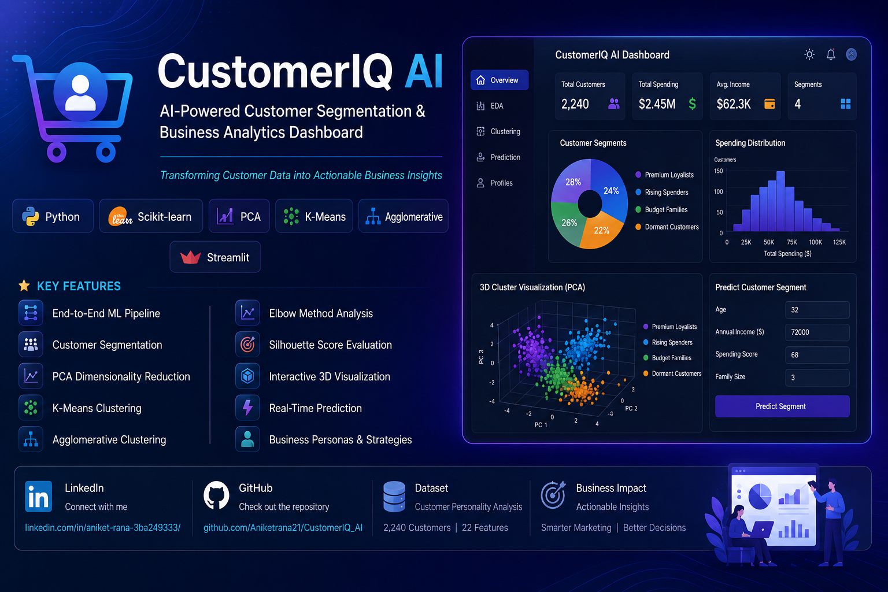
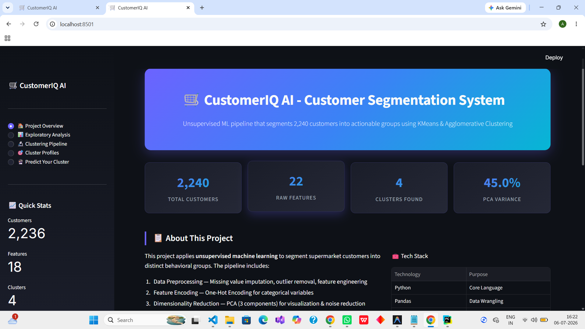
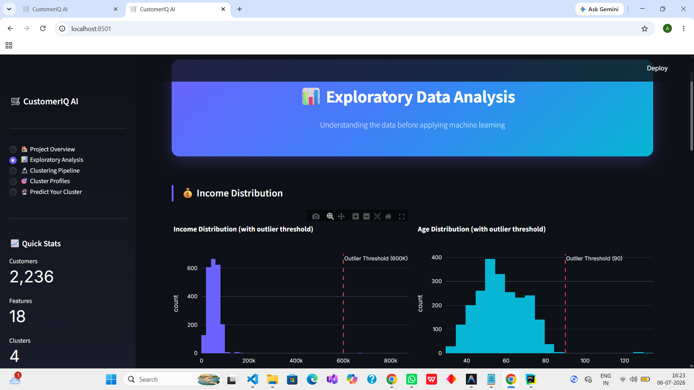
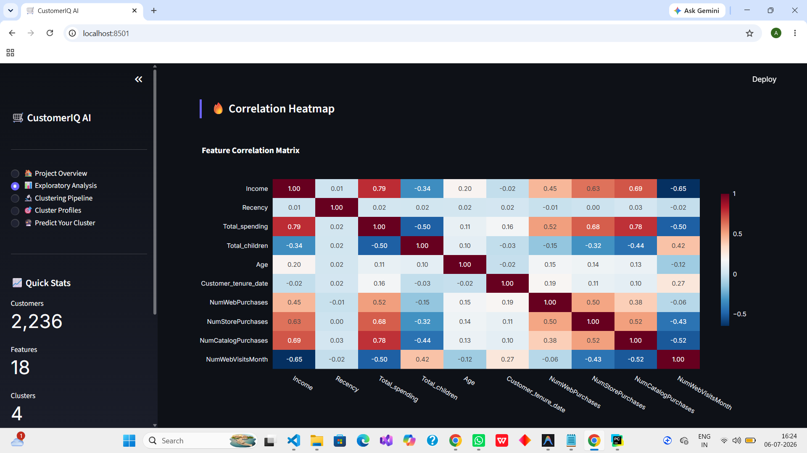
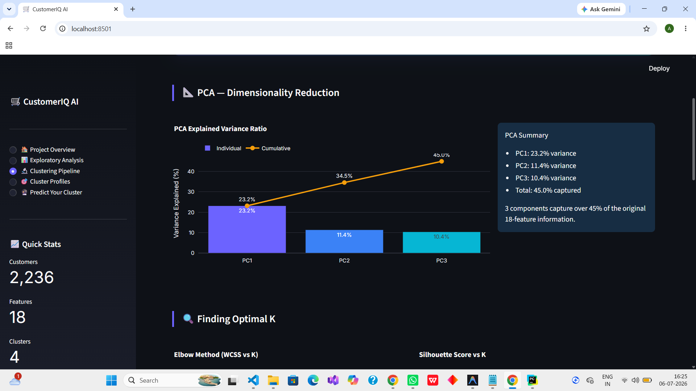
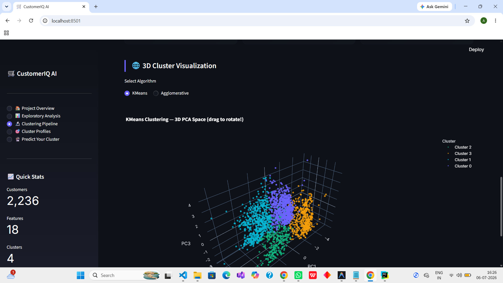
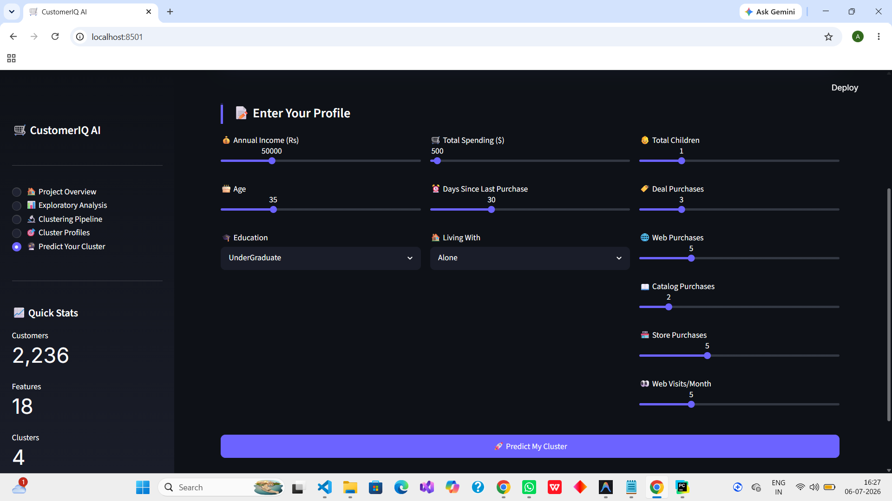
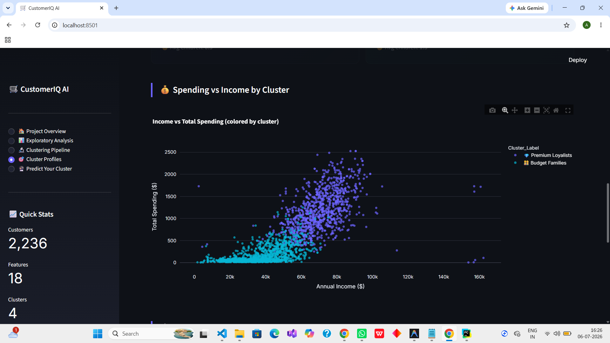
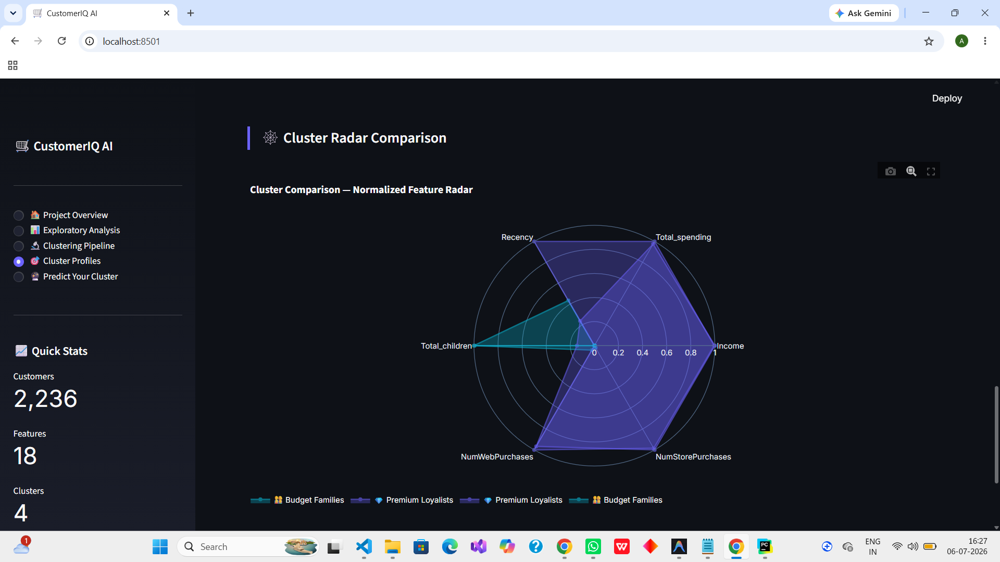

# 🛒 CustomerIQ AI

<p align="center">
  
</p>

<p align="center">

An end-to-end Machine Learning application that transforms customer purchase data into actionable business insights using PCA, K-Means, and Agglomerative Clustering.

</p>

<p align="center">

<a href="https://www.python.org/">

</a>

<a href="https://scikit-learn.org/">

</a>

<a href="https://streamlit.io/">

</a>


</p>

---

## 🌐 Live Demo


```
[https://customeriq-2026.streamlit.app/]
```

---

## 📂 Repository

GitHub

https://github.com/Aniketrana21/CustomerIQ_AI

---

## 💼 Connect With Me

LinkedIn

https://www.linkedin.com/in/aniket-rana-3ba249333/

GitHub

https://github.com/Aniketrana21

---

## 💡 Why CustomerIQ AI?

Most customer segmentation projects stop after generating clusters.

CustomerIQ AI goes one step further by transforming anonymous machine learning clusters into meaningful business personas with actionable marketing strategies.

The application enables businesses to better understand customer behavior, identify valuable customer groups, and make data-driven marketing decisions through an interactive dashboard.

---

## ✨ Key Features

- End-to-End Machine Learning Pipeline
- Interactive Streamlit Dashboard
- Customer Segmentation using Unsupervised Learning
- Principal Component Analysis (PCA)
- K-Means Clustering
- Agglomerative Clustering
- Elbow Method Analysis
- Silhouette Score Evaluation
- Interactive 3D Cluster Visualization
- Real-Time Customer Prediction
- Business-Friendly Customer Personas
- Marketing Recommendations

---

## 🏆 Project Highlights

- Processed 2,240 customer records
- Engineered meaningful customer behavior features
- Reduced dimensionality using PCA
- Compared K-Means and Agglomerative Clustering
- Built a real-time prediction pipeline
- Developed an interactive analytics dashboard
- Generated actionable customer personas for marketing teams

---

## 📊 Dataset

| Property | Value |
|-----------|-------|
| Dataset | Customer Personality Analysis |
| Customers | 2,240 |
| Original Features | 22 |
| ML Algorithms | PCA, K-Means, Agglomerative Clustering |
| Deployment | Streamlit |

---

## 🧠 Machine Learning Pipeline

```text
Raw Customer Dataset
        │
        ▼
Data Cleaning
        │
        ▼
Missing Value Handling
        │
        ▼
Feature Engineering
        │
        ▼
Categorical Encoding
        │
        ▼
Outlier Removal
        │
        ▼
StandardScaler
        │
        ▼
Principal Component Analysis
        │
        ▼
K-Means Clustering
        │
        ▼
Agglomerative Clustering
        │
        ▼
Cluster Evaluation
        │
        ▼
Business Segment Generation
```

---

## 🏗️ Application Architecture

```text
User
 │
 ▼
Streamlit Dashboard
 │
 ▼
Feature Engineering
 │
 ▼
StandardScaler
 │
 ▼
Principal Component Analysis
 │
 ▼
K-Means Model
 │
 ▼
Customer Segment Prediction
 │
 ▼
Business Recommendations
```

---

## 🎯 Customer Segments

| Segment | Description | Marketing Strategy |
|----------|-------------|--------------------|
| 💎 Premium Loyalists | High income & high spending | Loyalty rewards & premium offers |
| 🌟 Rising Spenders | Medium spending with growth potential | Upselling & personalized offers |
| 👨‍👩‍👧 Budget Families | Price-sensitive family customers | Bundle offers & discounts |
| 😴 Dormant Customers | Low engagement customers | Re-engagement campaigns |

---

## 📸 Dashboard Preview

### 🏠 Overview Dashboard

<p align="center">

</p>

---

### 📊 Exploratory Data Analysis

<p align="center">

</p>

<p align="center">

</p>

---

### 🔍 Clustering Analysis

<p align="center">

</p>

<p align="center">

</p>

---

### 🎯 Predict Customer Segment

<p align="center">

</p>

---

### 📋 Customer Profiles

<p align="center">

</p>

<p align="center">

</p>

---

## 🛠 Technology Stack

| Category | Technologies |
|-----------|--------------|
| Programming | Python |
| Data Processing | Pandas, NumPy |
| Machine Learning | Scikit-learn |
| Data Visualization | Plotly |
| Dashboard | Streamlit |
| Development | Jupyter Notebook |

---

## 📁 Project Structure

```text
CustomerIQ_AI/
│
├── app.py
├── README.md
├── requirements.txt
├── smartcart_customers.csv
├── SmartCart_Clustering_System.ipynb
│
├── assets/
├── components/
├── config/
├── data/
├── pages_app/
│
└── .streamlit/
```

---

## 🚀 Installation

Clone the repository

```bash
git clone https://github.com/Aniketrana21/CustomerIQ_AI.git
```

Move into the project

```bash
cd CustomerIQ_AI
```

Install dependencies

```bash
pip install -r requirements.txt
```

Run the application

```bash
streamlit run app.py
```

---

## 🚀 Future Enhancements

- RFM Customer Segmentation
- Customer Lifetime Value Prediction
- Explainable AI using SHAP
- Authentication System
- SQL Database Integration
- Docker Support
- AWS Deployment
- REST API Integration

---

## 👨‍💻 Author

Aniket Rana

Machine Learning • Data Science • Python • AI

LinkedIn

https://www.linkedin.com/in/aniket-rana-3ba249333/

GitHub

https://github.com/Aniketrana21

---

## ⭐ Support

If you found this project useful,

⭐ Star this repository

🍴 Fork the repository

💬 Share your feedback

🤝 Connect with me on LinkedIn

---

## 📄 License

This project is licensed under the MIT License.
